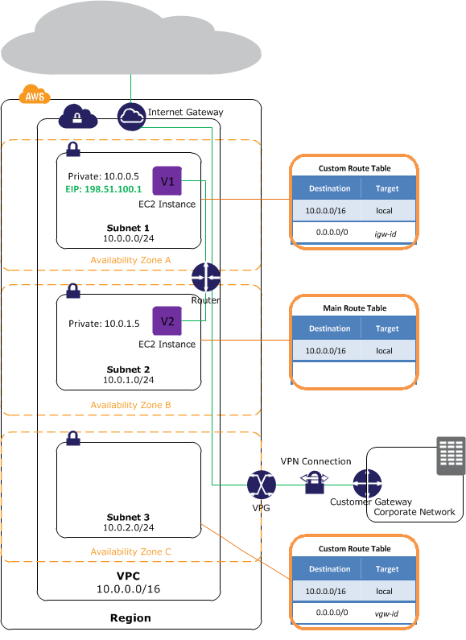

# Notes on AWS VPC (Virtual Private Cloud)

## Summary

- vpc is a user-defined virtual network.
- Subnets are defined by CIDR (Classless Inter-Domain Routing) block.
- You can have control on the entire vpc network by defining the route table for your vpc.

## Subnets

- Using CIDR for defining subnets.
  - [Wiki](https://en.wikipedia.org/wiki/Classless_Inter-Domain_Routing#IPv4_CIDR_blocks)
  - VPC: 10.0.0.0/16 --> this vpc has 65530 ip
  - Subnet A: 10.0.0.0/24 --> subnet with 250 ip
  - Subnet B: 10.0.1.0/24 --> subnet with 250 ip
- Each subnet can be in only one available zone.
  - If you want to run your service over multiple available zone, you will need multiple subnets.

