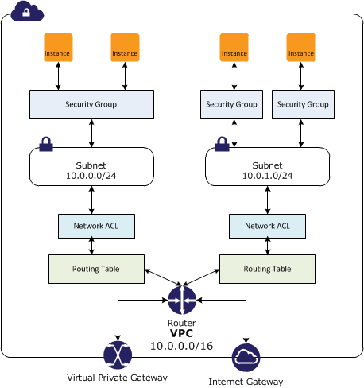

# Notes on AWS VPC (Virtual Private Cloud)

## Summary

- vpc is a user-defined virtual network.
- Subnets are defined by CIDR (Classless Inter-Domain Routing) block.
- You can have control on the entire vpc network by defining the route table for your vpc.

## Subnets

- Using CIDR for defining subnets.
  - [Wiki](https://en.wikipedia.org/wiki/Classless_Inter-Domain_Routing#IPv4_CIDR_blocks)
  - VPC: 10.0.0.0/24 --> this vpc has 256 ip
  - Subnet A: 10.0.0.0/25 --> subnet with 128 ip (10.0.0.0 ~ 10.0.0.127)
  - Subnet B: 10.0.128.0/25 --> subnet with 250 ip (10.0.128.0 ~ 10.0.0.255)
  - Some ip are preserved by the aws. Thus the number of ip that is available to you is **less** than the number of ip in theory.
- Each subnet can be in only one available zone.
  - If you want to run your service over multiple available zone, you will need multiple subnets.
- Each subnet has its own route table. 
- Every subnet that you create is automatically associated with the main route table for the VPC.
- If a subnet's traffic is routed to an IG (internet gateway), the subnet is known as a public subnet.
- Instance in a public subnet to communicate with the Internet, it must have a public IP address or an Elastic IP address.
- Subnet doesn't have a route to the Internet gateway, the subnet is known as a private subnet.
- Subnet doesn't have a route to the Internet gateway, but has its traffic routed to a virtual private gateway, the subnet is known as a VPN-only subnet.

## Security

